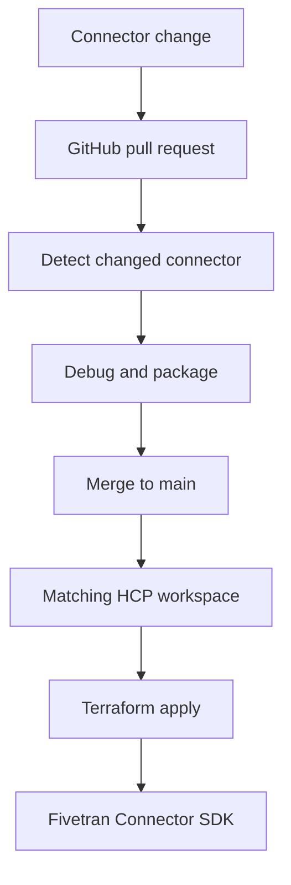

# Fivetran Connector SDK CI/CD Demo

[](https://github.com/kferenc3/fivetran-cicd-demo/actions/workflows/connector-cicd.yml)

A reproducible CI/CD demonstration for managing multiple [Fivetran Connector SDK](https://fivetran.com/docs/connector-sdk) connectors in a single GitHub repository.

The repository demonstrates how to:

- Develop and test Connector SDK connectors with Python and `uv`
- Package connectors independently
- Manage Fivetran resources with Terraform
- Store Terraform state in HCP Terraform without AWS
- Validate changes in pull requests
- Deploy after changes are merged to `main`
- Redeploy only the connector whose source code changed

> This repository contains dummy connectors and static demonstration data. It is intended for learning, internal demonstrations, and CI/CD experiments—not production workloads.

## Architecture



Each connector has its own HCP Terraform workspace and state file.

| Connector directory | HCP Terraform workspace | Destination schema |
|---|---|---|
| `billing_invoices` | `fivetran-sdk-billing_invoices` | `billing_invoices` |
| `crm_contacts` | `fivetran-sdk-crm_contacts` | `crm_contacts` |
| `product_events` | `fivetran-sdk-product_events` | `product_events` |
| `support_tickets` | `fivetran-sdk-support_tickets` | `support_tickets` |

This isolation is what allows one connector to be changed and deployed without planning or modifying the other connectors.

## Repository structure

```text
.
├── .github/
│   └── workflows/
│       └── connector-cicd.yml
├── connectors/
│   ├── billing_invoices/
│   │   ├── configuration.json
│   │   ├── connector.py
│   │   └── pyproject.toml
│   ├── crm_contacts/
│   │   ├── configuration.json
│   │   ├── connector.py
│   │   └── pyproject.toml
│   ├── product_events/
│   │   ├── configuration.json
│   │   ├── connector.py
│   │   └── pyproject.toml
│   └── support_tickets/
│       ├── configuration.json
│       ├── connector.py
│       └── pyproject.toml
├── terraform/
│   ├── main.tf
│   ├── outputs.tf
│   ├── provider.tf
│   ├── variables.tf
│   ├── versions.tf
│   └── .terraform.lock.hcl
├── .gitignore
├── pyproject.toml
├── uv.lock
└── README.md
```

Connector ZIP files are generated under each connector’s `files/` directory and are not committed.

## Prerequisites

You need:

- A GitHub account
- A Fivetran account
- An existing Fivetran group with a configured destination
- Permission to create connectors in that group
- An [HCP Terraform](https://app.terraform.io/) organization
- [Git](https://git-scm.com/)
- [uv](https://docs.astral.sh/uv/getting-started/installation/)
- [Terraform](https://developer.hashicorp.com/terraform/install)

The project currently uses:

- Python `3.14`
- Fivetran Connector SDK `2.11.x`
- Terraform `1.16.x`
- Fivetran Terraform provider `1.9.41`

## Local setup

### 1. Clone the repository

```bash
git clone https://github.com/kferenc3/fivetran-cicd-demo.git
cd fivetran-cicd-demo
```

### 2. Install uv

On macOS:

```bash
brew install uv
```

Alternatively, follow the official [uv installation guide](https://docs.astral.sh/uv/getting-started/installation/).

### 3. Install Terraform

On macOS:

```bash
brew tap hashicorp/tap
brew install hashicorp/tap/terraform
```

Verify the installations:

```bash
uv --version
terraform version
```

### 4. Install Python and project dependencies

```bash
uv python install 3.14
uv sync --locked --dev
```

No manual virtual-environment activation is required. `uv run` automatically uses the project environment.

## Running a connector locally

Debug one connector:

```bash
uv run fivetran debug connectors/crm_contacts
```

Package it:

```bash
uv run fivetran package connectors/crm_contacts --yes
```

The resulting ZIP file is created at:

```text
connectors/crm_contacts/files/crm_contacts.zip
```

The same commands work for the other connector directories.

Local debugging may generate a `warehouse.db` file. It is a local test artifact and should not be committed.

## HCP Terraform setup

HCP Terraform stores state and provides state locking. Terraform itself executes on the developer’s machine or GitHub-hosted runner.

### 1. Create an organization

Create or select an organization at [app.terraform.io](https://app.terraform.io/).

Then update the organization value in `terraform/versions.tf`:

```hcl
cloud {
  organization = "YOUR_HCP_TERRAFORM_ORGANIZATION"
}
```

### 2. Create the project

Create an HCP Terraform project named:

```text
fivetran-cicd-demo
```

Add this project tag:

```text
application = fivetran-cicd-demo
```

### 3. Create the workspaces

Create four CLI-driven workspaces inside the project:

```text
fivetran-sdk-billing_invoices
fivetran-sdk-crm_contacts
fivetran-sdk-product_events
fivetran-sdk-support_tickets
```

For every workspace, configure:

```text
Execution Mode: Local
```

For remote state sharing, retain:

```text
Share with specific workspaces
```

Leave the workspace list empty. The four connector states do not depend on each other.

Do not connect these workspaces directly to GitHub. GitHub Actions controls which workspace runs.

### 4. Test the HCP connection locally

Authenticate:

```bash
terraform login
```

Select a workspace:

```bash
export TF_WORKSPACE="fivetran-sdk-crm_contacts"
```

Initialize and validate:

```bash
terraform -chdir=terraform init
terraform -chdir=terraform fmt -check
terraform -chdir=terraform validate
```

## Fivetran system key

Create a Fivetran system key from:

```text
Account settings → General → System Keys
```

The key can use any descriptive name, such as:

```text
github-actions-fivetran-cicd
```

Replace `YOUR_GROUP_ID` in this permission document:

```json
[
  {
    "resource_type": "CONNECTOR",
    "access_level": "MANAGE",
    "resource_filter": {
      "group_ids": [
        "YOUR_GROUP_ID"
      ]
    }
  },
  {
    "resource_type": "DESTINATION",
    "access_level": "READ"
  }
]
```

These are the permissions documented by Fivetran for [Connector SDK CI/CD deployments](https://fivetran.com/docs/developer-resources/rest-api/getting-started/system-keys#required-permissions-for-connector-sdk).

Save the API key and API secret securely. The secret may only be displayed once.

Never commit either credential.

## HCP Terraform automation token

For a shared organization, the recommended configuration is:

1. Create an HCP Terraform team for GitHub Actions.
2. Give it **Write** access to the `fivetran-cicd-demo` project.
3. Create a team API token with an appropriate expiration.

The Write role permits plans, applies, workspace locking, and state updates without granting project administration.

For an isolated personal demo organization, an Owners team token can be used temporarily. It has full organization access, so use a short expiration and revoke it after the demonstration.

Do not use an organization API token. Organization tokens cannot perform the required workspace state operations.

## GitHub environment configuration

Create a GitHub environment named:

```text
dev
```

The workflow expects the following environment secrets:

| Secret | Description |
|---|---|
| `FIVETRAN_APIKEY` | Fivetran system key |
| `FIVETRAN_APISECRET` | Fivetran system-key secret |
| `TF_API_TOKEN` | HCP Terraform team or user token |

Add this environment variable:

| Variable | Description |
|---|---|
| `FIVETRAN_GROUP_ID` | ID of the existing Fivetran destination group |

Configure the environment’s deployment branch rule to allow deployments from `main`.

Optional environment-protection rules can require manual approval before deployment.

## CI/CD behavior

The workflow is defined in:

```text
.github/workflows/connector-cicd.yml
```

### Pull requests

Pull requests run validation only:

1. Detect changed connectors.
2. Install Python and dependencies with `uv`.
3. Debug the selected connectors.
4. Package the selected connectors.
5. Validate the Terraform configuration.

Pull requests cannot deploy and do not access the `dev` environment credentials.

### Merges to `main`

After a pull request is merged:

1. The workflow detects the changed connectors.
2. Each selected connector is packaged.
3. Its matching HCP workspace is selected.
4. Terraform creates a plan.
5. Terraform applies the saved plan.
6. The package and connector are updated in Fivetran.

### Manual execution

Running the workflow manually through **Actions → Connector CI/CD → Run workflow** selects all four connectors.

### Change-selection rules

| Changed path | Result |
|---|---|
| `connectors/crm_contacts/**` | Validate and deploy only `crm_contacts` |
| `connectors/product_events/**` | Validate and deploy only `product_events` |
| Multiple connector directories | Process only those connectors |
| `terraform/**` | Process all four connectors |
| Root `pyproject.toml` | Process all four connectors |
| Root `uv.lock` | Process all four connectors |
| Workflow file | Process all four connectors |
| README or unrelated documentation | No connector deployment |
| Manual workflow execution | Process all four connectors |

Shared dependency, Terraform, and workflow changes select every connector because they may affect every deployment.

## Typical development workflow

1. Create a feature branch.
2. Modify one connector.
3. Test it locally:

```bash
uv run fivetran debug connectors/product_events
```

4. Commit and push the change.
5. Open a pull request.
6. Confirm that only the changed connector is validated.
7. Merge the pull request.
8. Confirm that only the matching connector is deployed.

For example, changing only:

```text
connectors/product_events/connector.py
```

should result in:

```text
Validate product_events
Deploy product_events
```

The other connector workspaces should remain untouched.

## Optional local Terraform plan

Load the Fivetran credentials into your shell without committing them:

```bash
export FIVETRAN_APIKEY="YOUR_API_KEY"
export FIVETRAN_APISECRET="YOUR_API_SECRET"
export TF_VAR_group_id="YOUR_GROUP_ID"
export TF_VAR_connector_name="crm_contacts"
export TF_WORKSPACE="fivetran-sdk-crm_contacts"
```

Package the connector:

```bash
uv run fivetran package connectors/crm_contacts --yes
```

Create a plan:

```bash
terraform -chdir=terraform init
terraform -chdir=terraform plan
```

Review the plan carefully before running `terraform apply`.

Avoid entering literal secrets in shell commands on shared systems because they may be retained in shell history. Prefer your shell’s secure input mechanism or a trusted secret manager.

## Why separate Terraform workspaces?

Every workspace contains only two managed resources:

```text
fivetran_connector_sdk_package.this
fivetran_connector.this
```

Using one workspace per connector provides:

- Independent state
- Independent locking
- Smaller Terraform plans
- Reduced deployment scope
- Clear connector ownership
- No accidental updates to unchanged connectors

The Fivetran provider hashes the Connector SDK ZIP file. A change to the ZIP contents causes Terraform to upload a new package and update the corresponding connector.

## Security considerations

- Never commit Fivetran or HCP credentials.
- Store deployment credentials in the protected `dev` GitHub environment.
- Restrict the Fivetran system key to the intended group.
- Prefer an HCP team token over a personal token.
- Use short token expiration periods.
- Rotate or revoke credentials after public demonstrations.
- Do not run this demo against a production customer destination.
- Review Terraform plans before expanding this pattern to production.

Pull-request workflows do not receive the deployment environment credentials.

## Costs

HCP Terraform’s Free plan currently supports up to 500 managed resources. This demo manages approximately eight resources across four workspaces and should fit comfortably within that allowance.

Fivetran usage, destination infrastructure, and GitHub Actions consumption are separate and may have their own costs.

Review the current [HCP Terraform plans](https://developer.hashicorp.com/terraform/cloud-docs/overview#free-plan) before running the demo.

## Troubleshooting

### `Unable to resolve action astral-sh/setup-uv@v10`

Use the exact action release:

```yaml
uses: astral-sh/setup-uv@v10.0.1
```

### `Unable to reserve cache ... another job may be creating this cache`

This is a harmless warning caused by parallel matrix jobs attempting to save the same `uv` cache. One job saves the cache while the others continue normally.

To create separate caches, add this to both `setup-uv` steps:

```yaml
cache-suffix: ${{ matrix.connector }}
```

### Connector package not found

Run:

```bash
uv run fivetran package connectors/CONNECTOR_NAME --yes
```

Confirm that this file exists:

```text
connectors/CONNECTOR_NAME/files/CONNECTOR_NAME.zip
```

### Fivetran returns `401 Unauthorized`

Check that:

- `FIVETRAN_APIKEY` contains the key rather than a Base64 value.
- `FIVETRAN_APISECRET` contains the matching secret.
- The system key has not expired or been rotated.

### Fivetran returns `403 Forbidden`

Check that:

- The system key has `CONNECTOR: MANAGE`.
- It has `DESTINATION: READ`.
- The connector permission includes the correct group ID.
- `FIVETRAN_GROUP_ID` matches the selected group.

### Terraform cannot access HCP Terraform

Check:

- `TF_API_TOKEN` is a valid team or user token.
- The token has Write access to the project.
- The workspace uses Local execution mode.
- The workspace name matches `fivetran-sdk-CONNECTOR_NAME`.
- The project and `application` tag match `terraform/versions.tf`.

Terraform receives the GitHub secret as:

```text
TF_TOKEN_app_terraform_io
```

### Terraform cannot select a workspace

Verify all four workspaces:

- Belong to the `fivetran-cicd-demo` project
- Have the `application = fivetran-cicd-demo` inherited tag
- Use the exact names documented above

## Cleanup

To remove a deployed connector, select its workspace and run Terraform destroy with the correct variables and credentials loaded:

```bash
export TF_WORKSPACE="fivetran-sdk-crm_contacts"
export TF_VAR_connector_name="crm_contacts"
export TF_VAR_group_id="YOUR_GROUP_ID"

uv run fivetran package connectors/crm_contacts --yes
terraform -chdir=terraform init
terraform -chdir=terraform plan -destroy
terraform -chdir=terraform destroy
```

Review the destroy plan carefully before confirming it.

Repeat only for workspaces whose demo resources you want to remove. After destroying the resources, you can optionally remove:

- The four HCP Terraform workspaces
- The HCP automation token
- The Fivetran system key
- The GitHub `dev` environment credentials

Deleting a workspace without first destroying its managed resources does not delete the corresponding Fivetran resources.

## Limitations

This demo intentionally does not include:

- Production-grade source API integrations
- Connector configuration secrets
- Destination provisioning
- Automated rollback
- Multiple deployment environments
- Production approval and governance policies
- Automated Terraform destroy workflows

These can be added as follow-up exercises.

## Resources

- [Fivetran Connector SDK documentation](https://fivetran.com/docs/connector-sdk)
- [Fivetran Terraform provider](https://registry.terraform.io/providers/fivetran/fivetran/latest/docs)
- [Fivetran system keys](https://fivetran.com/docs/developer-resources/rest-api/getting-started/system-keys)
- [HCP Terraform documentation](https://developer.hashicorp.com/terraform/cloud-docs)
- [GitHub Actions documentation](https://docs.github.com/actions)
- [uv documentation](https://docs.astral.sh/uv/)
- [Terraform documentation](https://developer.hashicorp.com/terraform/docs)

## Author

Created by Ferenc Kiss as a practical demonstration of selective CI/CD deployment for Fivetran Connector SDK connectors.